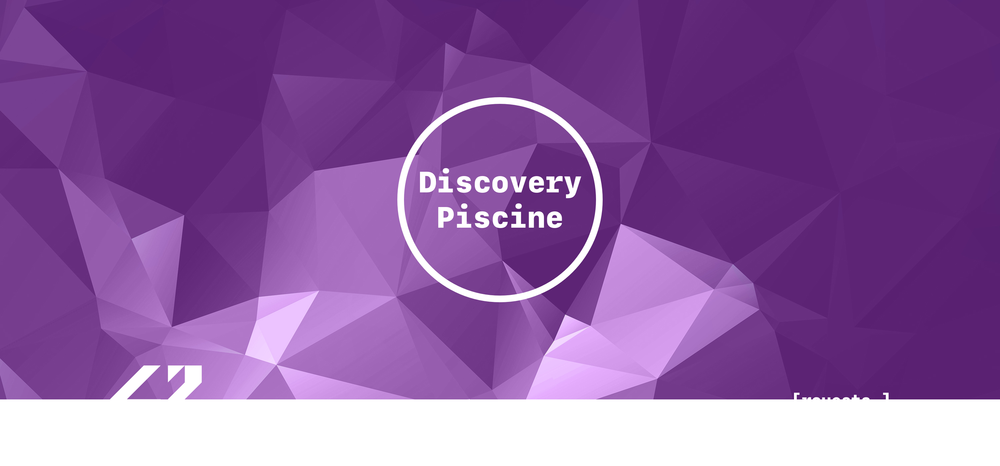
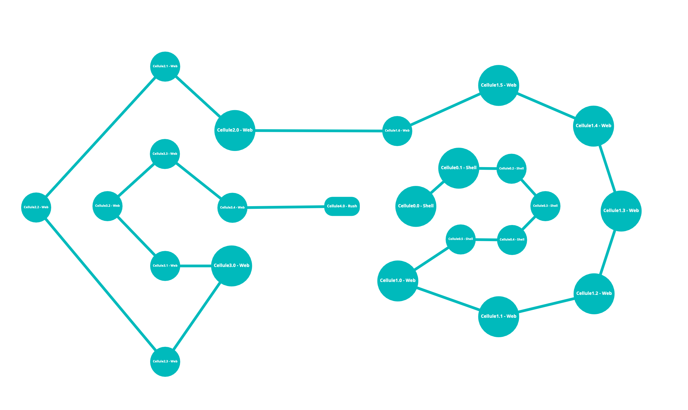

<!-- PROJECT LOGO -->
 

  

  

    Projects carried out during the discovery piscine of 42 Madrid web development. Languages used: HTML, CSS and JavaScript.
     
    <a style="color:#874EA0" href="https://cdn.intra.42.fr/pdf/pdf/28462/es.subject.pdf"><strong>Explore the subject »</strong></a>
     
     
     <a style="color:#874EA0" href="https://github.com/raqelcb">Home</a>
    ·
    <a style="color:#874EA0" href="https://github.com/raqelcb/42cursus">42Cursus</a>
    ·
    <a style="color:#874EA0" href="https://github.com/raqelcb/discovery_piscine">Discovery_Piscine</a>
  

 

   </a> 

 

<!-- TABLE OF CONTENTS -->
## Table of Contents 📑

- [About the project](#about-the-project)
  * [Parts of the project](#parts-of-the-project)
  * [Languages](#languages)
  * [Technologies](#technologies)
  * [Programming Time](#programming-time)
- [License](#license)
- [Holygraph](#holygraph)

 

<!-- ABOUT THE PROJECT -->
## About The Project 🗣️

<!-- [![Product Name Screen Shot][product-screenshot]](https://example.com) -->
Projects carried out during the discovery piscine of **42 Madrid** web development. 

 

### Parts of the project 🧩

* [x] **Cellule0:** Shell
* [x] **Cellule1:** HTML and CSS
* [x] **Cellule2:** HTML, CSS and (JavaScript)
* [x] **Cellule3:** HTML, CSS and JavaScript
* [x] **Cellule4:** Rush

 

### Languages 👅

* `Shell`
* `HTML`
* `CSS`
* `JavaScript`
* `jQuery`

 

### Technologies 🛠

* [x] Shell
* [x] HTML
* [x] CSS
* [x] JavaScript
* [x] jQuery

 

### Programming Time ⏰
About 1 week

 

<!--LICENSE -->
## License ⚖️

Distributed under the [MIT](https://choosealicense.com/licenses/mit/) License. See `LICENSE` for more information.

 

## Holygraph 🌌

<!-- ACKNOWLEDGEMENTS
## Acknowledgements

* 
* 
*  -->

